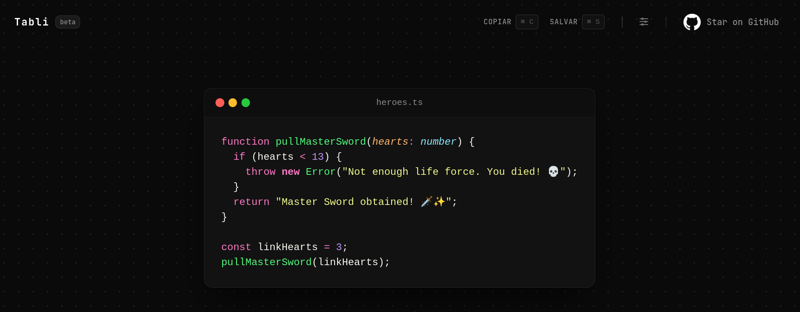

# Tabli

<p align="center">
  
</p>

<p align="center">
  <strong>Create beautiful images from code snippets and tables, entirely in your browser.</strong>
</p>

<p align="center">
  Inspired by <a href="https://ray.so">Ray.so</a>, with first-class support for tables.
</p>

---

## Preview

<p align="center">
  
</p>

Tabli is a lightweight tool for creating polished images from code snippets and structured tables. Everything runs locally in your browser. No account, no uploads, no server processing.

## Features

### Code snippets

- ✨ Syntax highlighting powered by Shiki, with automatic language detection as you type
- 🪄 One-click formatting via Prettier
- 📝 Inline editing with live preview and an editable filename
- 🔢 Optional line numbers and window controls
- ↔️ Drag-to-resize card from either edge, with auto-fit back to content
- 🔠 Adjustable font size and padding presets

### Tables

- 📊 Dedicated table editor with inline cell editing
- ➕ Add or remove rows and columns
- 📥 Import from CSV (powered by Papa Parse)
- ↔️ Per-column resizing, with a one-click width auto-fit
- ⚠️ Overflow warnings when content stops fitting cleanly

### Themes

- 🎨 18 curated editor themes, each pairing a canvas gradient, card background, Shiki syntax theme, and table header accent so everything matches
- 🔲 Toggle the canvas background on or off independently of the theme

### Export

- 📋 Copy directly to your clipboard
- 💾 Download as PNG or JPEG, at 2x, 4x, or 6x scale
- 🖋️ Optional "Made with Tabli" watermark
- ⚡ High-quality rendering powered by `html2canvas-pro`

### Workspace

- 💾 Preferences and current content persist locally, so a refresh never loses your work
- 🕘 Snapshot history to restore a previous code snippet or table
- ⌨️ Keyboard shortcuts for focusing the editor, cycling theme/padding/language, formatting, toggling line numbers/background/window controls, and exporting
- 🌐 Interface available in Portuguese (pt-BR) and English (en-US), detected automatically from the browser

---

## Tech Stack

- Next.js (App Router)
- React
- TypeScript
- Tailwind CSS v4
- Shiki
- Papa Parse
- html2canvas-pro

---

## Getting Started

```bash
git clone https://github.com/sjunqueira/tabli.git

cd tabli

npm install

npm run dev
```

Open `http://localhost:3000`.

---

## Roadmap

- [ ] More languages

---

## Built with AI

Tabli was developed with the assistance of AI tools throughout the development process, from brainstorming and UI iterations to implementation support and code review. Design decisions, architecture, and the final implementation were curated and validated by the author.

---

## Contributing

Contributions, ideas and feedback are welcome. Feel free to open an issue or submit a pull request.

---

## License

MIT
