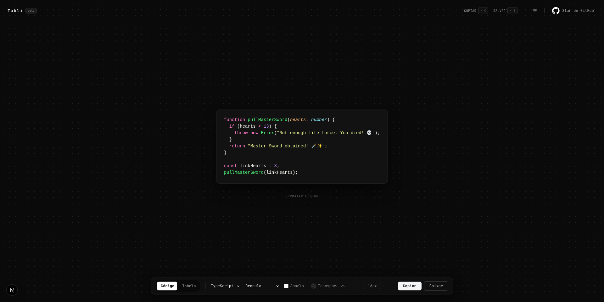

# Tabli

<p align="center">
  
</p>

<p align="center">
  Create beautiful images from code snippets and tables — entirely in your browser.
</p>

<p align="center">
  Inspired by <a href="https://ray.so">Ray.so</a>, with first-class support for tables.
</p>

---

## Features

### Code snippets

- ✨ Syntax highlighting powered by Shiki
- 📝 Inline editing with live preview
- 📄 Editable filename
- 🌐 Multiple languages and themes
- 🖼️ Adjustable backgrounds and padding

### Tables

- 📊 Visual table editor
- ➕ Add, edit and remove rows and columns
- 📸 Export clean, presentation-ready tables

### Export

- 📋 Copy directly to the clipboard
- 💾 Download as PNG
- ⚡ High-quality rendering with `html2canvas-pro`

---

## Tech Stack

- Next.js (App Router)
- React
- TypeScript
- Tailwind CSS v4
- Shiki
- Papa Parse
- html2canvas-pro

---

## Getting Started

```bash
git clone https://github.com/sjunqueira/tabli.git

cd tabli

npm install

npm run dev
```

Then open:

```
http://localhost:3000
```

---

## Roadmap

- [ ] Persist editor state in Local Storage
- [ ] Import tables from CSV
- [ ] More export formats (SVG)
- [ ] Keyboard shortcuts
- [ ] More background presets

---

## Contributing

Contributions, ideas and feedback are always welcome.

If you'd like to improve Tabli, feel free to open an issue or submit a pull request.

---

## License

MIT